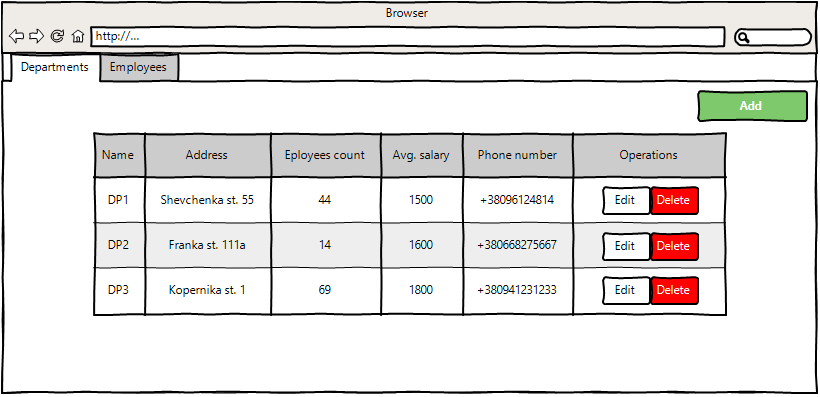
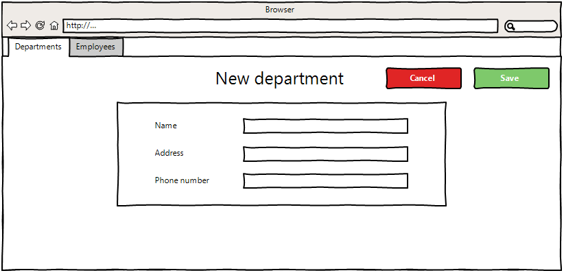
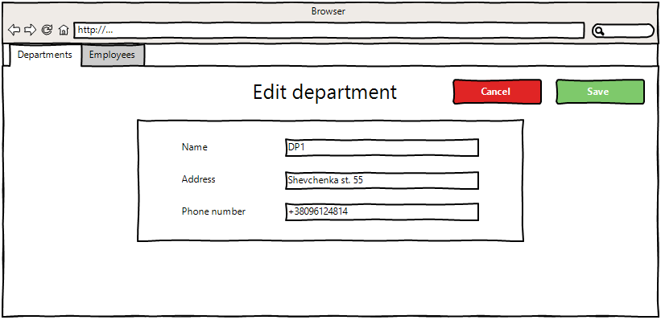
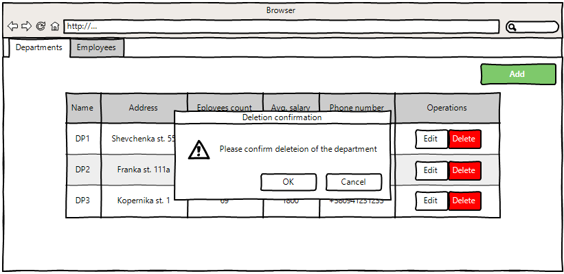
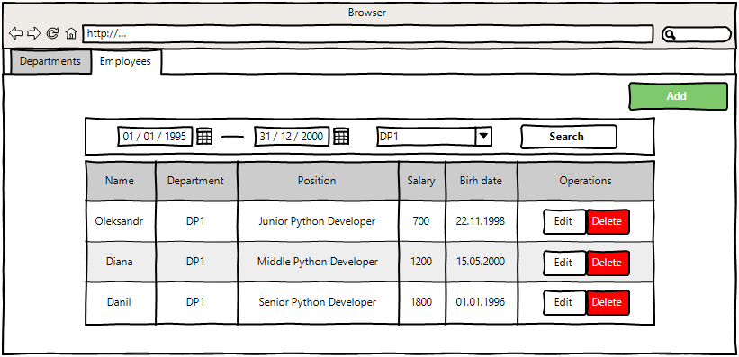
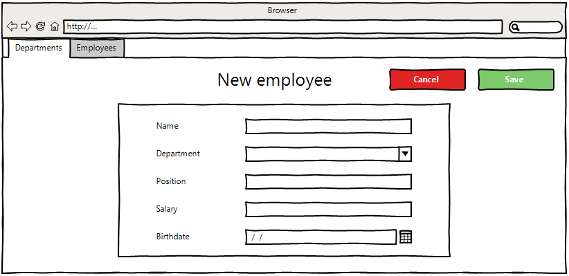
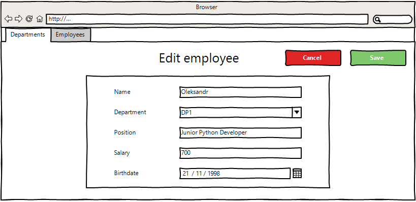
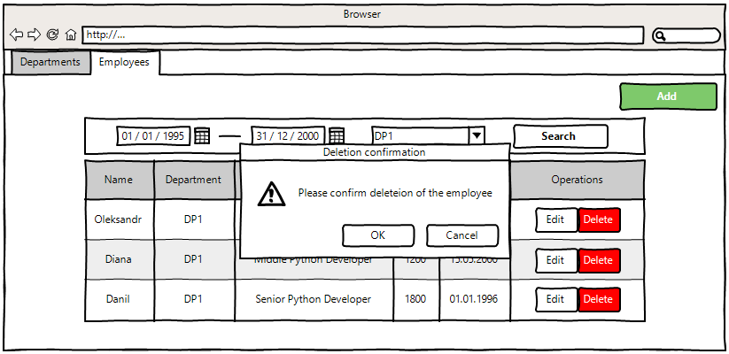

# Department Management App

### "Department Management App" is web which allows users to manage information about departments and employees.

Application should provide:
- Storing rental departments and employees in a database;
- Display list of departments;
- Updating the list of departments (adding, editing, removing);
- Display list of employees;
- Updating the list of employees (adding, editing, removing);
- Filtering by birthdate for employees.

## 1. Departments
### 1.1 Display list of departments
#### Main scenario:
- User selects item "Departments";
- Application displays list of departments.

  
Pic. 1.1 View the departments list

The page displays the following items:
- Department mame;
- Department address;
- Employees count;
- Average employee salary;
- Phone number.
Aggregate function: Average employee salary = Employees salaries sum / Employees count.

### 1.2 Add Department
#### Main scenario:
- User clicks "Add" button in the departments list view mode;
- Application displays a form to enter department data;
- User enters department data and clicks "Save" button;
- If any data is entered incorrectly, incorrect data messages are displayed;
- If entered data is valid, then a record is added to the database;
- List of departments with added records is displayed.
#### Cancel operation scenario:
- User clicks "Add" button in the departments list view mode;
- Application displays a form to enter department data;
- User clicks "Cancel" button;
- Entered data is not saved to the database and list of departments is displayed;
- If the user selects the menu item "Departments" or "Employees", the data will not be saved to the database and the corresponding form will be opened.

  
Pic. 1.2 Add a department.

When adding a department, the following details are entered:
- Department name;
- Department address;
- Department phone number.

Constraints for data validation:
- Department name - maximum length of 100 characters;
- Department address - maximum length of 100 characters;
- Department phone number - starts with +, length from 12 to 14 characters.

### 1.3 Edit department
#### Main scenario:
- User clicks "Edit" button in the departments list view mode;
- Application displays a form to enter department data;
- User enters department data and clicks "Save" button;
- If any data is entered incorrectly, incorrect data messages are displayed;
- If entered data is valid, then edited data is added to the database;
- List of departments with edited records is displayed.
#### Cancel operation scenario:
- User clicks "Edit" button in the departments list view mode;
- Application displays a form to enter department data;
- User clicks "Cancel" button;
- Entered data is not saved to the database and list of departments is displayed.
- If the user selects the menu item "Departments" or "Employees", the data will not be saved to the database and the corresponding form will be opened.

Pic. 1.3 Edit a department.

When editing a department, the following details are entered:
- Department name;
- Department address;
- Department phone number.

Constraints for data validation:
- Department name - maximum length of 100 characters;
- Department address - maximum length of 100 characters;
- Department phone number - starts with +, length from 12 to 14 characters.
### 1.4 Delete department
#### Main scenario:
- User clicks "Delete" button in the departments list view mode;
- A confirmation dialog is displayed;
- User confirms removal of the department;
- Record is deleted from database;
- If error occurs, then an error message is displayed;
- If department record is successfully deleted, then list of departments without changes is displaying. 
#### Cancel operation scenario:
- User clicks "Delete" button in the departments list view mode;
- A confirmation dialog is displayed;
- User cancels deletion of the department;
- List of departments is displayed. 

  
Pic. 1.4 Delete a department.

## 2. Employees
### 2.1 Display list of employees
#### Main scenario:
- User selects item "Employees";
- Application displays list of employees.

  
Pic. 2.1 View the employees list

The page displays the following items:
- Employee name;
- Employee's department;
- Employee position;
- Employee salary;
- Employee birthdate.

#### Filtering by date:
- In the employees list view mode, the user sets a date filter and clicks the "Search" button;
- The app shows the employees that were born during the specified time period.

Restrictions:
- Start date should be less than end date;
- If start date is blank, then filtering by end date only;
- If end date is blank, then filtering by start date only;
- Updating data after selecting the filtering conditions is carried out by clicking “Refresh” button.

#### Filtering by department:
- In the employees list view mode, the user chooses department and clicks the "Search" button;
- The app shows the employees that belong to a specified department.

Restrictions:
- User can only filter by departments that are present in the combo box;
- Updating data after selecting the filtering conditions is carried out by clicking “Refresh” button.

### 2.2 Add employee
#### Main scenario:
- User clicks "Add" button in the employees list view mode;
- Application displays a form to enter employee data;
- User enters employee data and clicks "Save" button;
- If any data is entered incorrectly, incorrect data messages are displayed;
- If entered data is valid, then a record is added to the database;
- List of employees with added records is displayed.
#### Cancel operation scenario:
- User clicks "Add" button in the employees list view mode;
- Application displays a form to enter employee data;
- User clicks "Cancel" button;
- Entered data is not saved to the database and list of employees is displayed;
- If the user selects the menu item "Departments" or "Employees", the data will not be saved to the database and the corresponding form will be opened.

  
Pic. 2.2 Add an employee.

When adding an employee, the following details are entered:
- Employee name;
- Employee department;
- Employee position;
- Employee salary;
- Employee birthdate.

Constraints for data validation:
- Employee name - maximum length of 100 characters;
- Employee department - is chosen from combo box;
- Employee position - maximum length of 100 characters;
- Employee salary - integer value;
- Employee birthdate - date.

### 2.3 Edit employee
#### Main scenario:
- User clicks "Edit" button in the employees list view mode;
- Application displays a form to enter employee data;
- User enters employee data and clicks "Save" button;
- If any data is entered incorrectly, incorrect data messages are displayed;
- If entered data is valid, then edited data is added to the database;
- List of employees with edited records is displayed.
#### Cancel operation scenario:
- User clicks "Edit" button in the employees list view mode;
- Application displays a form to enter employee data;
- User clicks "Cancel" button;
- Entered data is not saved to the database and list of employees is displayed.
- If the user selects the menu item "Departments" or "Employees", the data will not be saved to the database and the corresponding form will be opened.

  
Pic. 2.3 Edit an employee. 

When editing a department, the following details are entered:
- Employee name;
- Employee department;
- Employee position;
- Employee salary;
- Employee birthdate.

Constraints for data validation:
- Employee name - maximum length of 100 characters;
- Employee department - is chosen from combo box;
- Employee position - maximum length of 100 characters;
- Employee salary - integer value;
- Employee birthdate - date.

### 2.4 Delete employee
#### Main scenario:
- User clicks "Delete" button in the employees list view mode;
- A confirmation dialog is displayed;
- User confirms removal of the employee;
- Record is deleted from database;
- If error occurs, then an error message is displayed;
- If employee record is successfully deleted, then list of employees without changes is displaying. 
#### Cancel operation scenario:
- User clicks "Delete" button in the employees list view mode;
- A confirmation dialog is displayed;
- User cancels deletion of the employee;
- List of employees is displayed. 

  
Pic. 2.4 Delete a n employee.